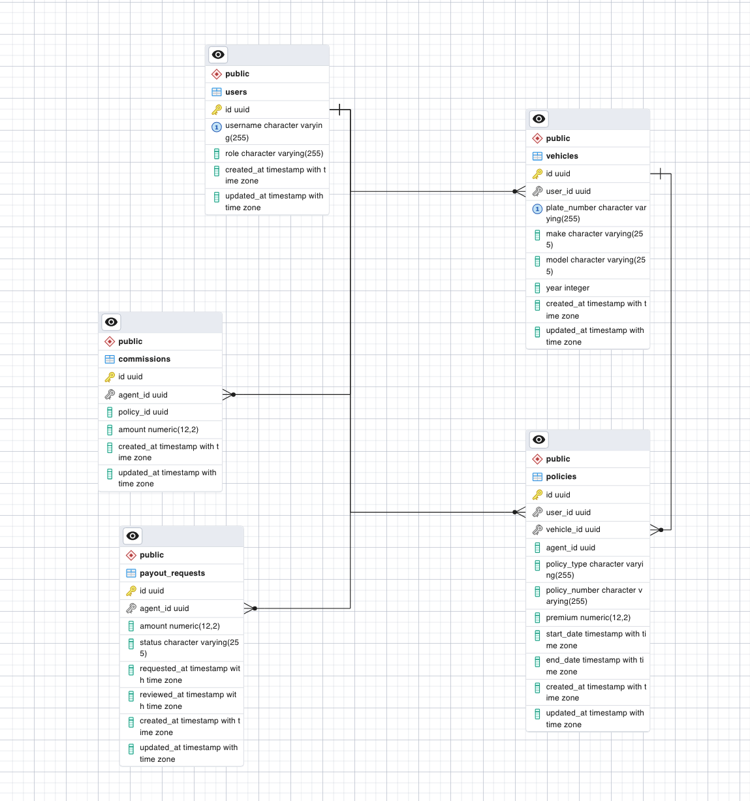

# InsuranceTech API
Welcome to a Simple Insurance API – a backend service that helps manage agents, insurance policies, commissions, and payout requests. It models the critical workflow from policy sales by agents to commission earnings and payout management.
## Overview

The API provides the following functionalities:

1. Tracks insurance policies sold by agents.
2. Calculates commissions earned by agents based on policies.
3. Provides a breakdown of earnings by policy type.
4. Allows agents to request payouts based on available commissions.
5. Supports filtering of policies by type for easy reporting.

## Key Features

1. Policy Management: Agents can sell third-party or comprehensive insurance policies.
2. Commission Tracking: Commissions are automatically associated with policies.
3. Earnings Breakdown: View total earnings, earnings from the last 30 days, and categorized breakdown by policy type.
4. Payout Requests: Agents can request payouts for their commissions, which deducts from the available balance.
5. Database-Level Aggregation: Calculations such as total earned, recent earnings, and policy breakdowns are done using raw SQL for performance.
6. Model Relationships: Establish strong relationships between users, policies, commissions, and vehicles.

## API Endpoints

https://documenter.getpostman.com/view/11352884/2sB2j7dV8n

## Getting Started

### Requirements
1. Node.js version 22 and above
2. PostgresSQL database


### Installation

1. clone the repository
2. install dependencies (yarn install or npm install)
   ```
   # using npm
   npm install
   
   # using yarn
   yarn install
   ```
3. configure database and environment
    ```
    # create .env file at the root of your project
    # update .env file with database credentials like below
    DB_USERNAME=*****
    DB_PASSWORD=*****
    DB_DATABASE=etapinsurance
    DB_HOST=localhost
    DB_PORT=5432
    PORT=3000
    NODE_ENV=development
   ```
4. Run migration and seeders (yarn run db:fresh or npm run db:fresh)
    ```
   yarn run db:fresh 
   OR
   npm run db:fresh
   ```
5. Start server (yarn run start or npm run start)
    ```
    yarn run start
   OR
    npm run start
   ```
6. Run test (yarn run test or npm run test)
    ```
    yarn run test
    OR
    npm run test
    ```

## Database Schema




